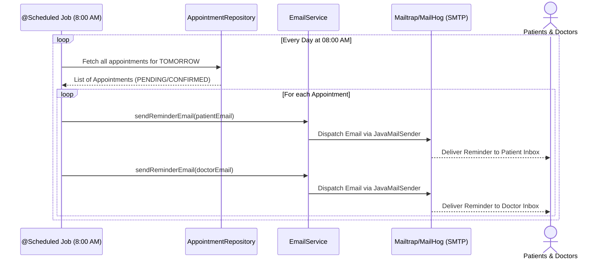

# Doctor Appointment System

A REST API for managing doctors, patients, and appointment bookings — built with **Spring Boot 3 + Java 17**, layered architecture, JWT authentication, and role-based access control.

## Tech Stack

- Java 17, Spring Boot 3.3
- Spring Web, Spring Data JPA, Spring Security
- PostgreSQL (production) / H2 (local dev, in-memory)
- JWT (jjwt 0.12.x)
- Lombok
- springdoc-openapi (Swagger UI)
- Maven
- Docker / docker-compose

## Architecture

```
controller  -> handles HTTP, request validation
service     -> business logic, interfaces + impl
repository  -> Spring Data JPA interfaces
entity      -> JPA entities
dto         -> request/response records (never expose entities directly)
mapper      -> entity <-> DTO conversion
security    -> JWT filter, JWT util, UserDetailsService
config      -> SecurityConfig, SwaggerConfig
exception   -> custom exceptions + @RestControllerAdvice
```

### 1. Booking an Appointment Flow
This sequence demonstrates how the backend securely processes an appointment booking.

```mermaid
sequenceDiagram
    actor Patient
    participant API as AppointmentController
    participant Auth as SecurityFilter
    participant Service as AppointmentService
    participant DB as Database

    Patient->>API: POST /api/appointments
    API->>Auth: Validate JWT Token
    Auth-->>API: User Context (Patient ID)
    
    API->>Service: bookAppointment(DTO)
    Service->>DB: Check Doctor availability
    DB-->>Service: Return available slots
    
    alt Slot is already taken
        Service-->>API: Throw AppointmentConflictException
        API-->>Patient: 400 Bad Request (Conflict)
    else Slot is available
        Service->>DB: Save new Appointment (Status: PENDING)
        DB-->>Service: Appointment Saved
        Service-->>API: AppointmentResponseDTO
        API-->>Patient: 201 Created (Success)
    end
    ..
```

### 2. Scheduled Email Reminders Flow
This sequence demonstrates the asynchronous background job that sends reminders using `JavaMailSender`.


## Quick Start (no DB install needed)

Runs with an in-memory H2 database — good for trying the API immediately.

```bash
mvn clean install
mvn spring-boot:run -Dspring-boot.run.profiles=dev
```

App runs at `http://localhost:8083`
Swagger UI: `http://localhost:8083/swagger-ui.html`
H2 console: `http://localhost:8083/h2-console` (JDBC URL: `jdbc:h2:mem:doctordb`, user `sa`, no password)

## Run with PostgreSQL (production-like)

### Option A: Docker Compose (recommended)

```bash
docker-compose up --build
```

This starts Postgres + the app together. App available at `http://localhost:8083`.

### Option B: Local Postgres

1. Create a database:
```sql
CREATE DATABASE doctor_appointment_db;
```
2. Update `src/main/resources/application.properties` with your DB credentials if different from defaults.
3. Run:
```bash
mvn spring-boot:run
```

## Authentication Flow

1. **Register** a user (role: `ADMIN`, `DOCTOR`, or `PATIENT`):
```bash
curl -X POST http://localhost:8083/api/auth/register \
  -H "Content-Type: application/json" \
  -d '{"email":"admin@clinic.com","password":"secret123","role":"ADMIN"}'
```

2. **Login** to get a JWT:
```bash
curl -X POST http://localhost:8083/api/auth/login \
  -H "Content-Type: application/json" \
  -d '{"email":"admin@clinic.com","password":"secret123"}'
```

3. Use the returned `token` in the `Authorization` header for subsequent calls:
```bash
curl http://localhost:8083/api/doctors \
  -H "Authorization: Bearer <token>"
```

## Example Endpoints

| Method | Endpoint | Auth | Description |
|---|---|---|---|
| POST | `/api/auth/register` | public | Create a login account |
| POST | `/api/auth/login` | public | Get a JWT |
| POST | `/api/doctors` | ADMIN | Create a doctor profile |
| GET | `/api/doctors?specialization=Cardiology` | any authenticated | List/filter doctors |
| POST | `/api/patients` | any authenticated | Register a patient profile |
| POST | `/api/appointments` | any authenticated | Book an appointment (conflict-checked) |
| GET | `/api/appointments/available-slots?doctorId=1&date=YYYY-MM-DD` | any authenticated | Get 30-min available time slots for a doctor |
| GET | `/api/appointments/patient/{id}` | PATIENT (owner) | List a patient's appointments |
| GET | `/api/appointments/doctor/{id}?page=0&size=10` | DOCTOR (owner) | Paginated doctor schedule |
| PATCH | `/api/appointments/{id}/status?status=CONFIRMED` | ADMIN, DOCTOR | Change appointment status |
| DELETE | `/api/appointments/{id}` | PATIENT (owner), DOCTOR | Cancel an appointment |

> **Security Note:** The API implements strict ownership-based authorization. A `PATIENT` can only view, create, or cancel appointments that belong to them. A `DOCTOR` can only modify their own schedule.

## Running Tests

```bash
mvn test
```

## Advanced Features (Newly Added)

- **Ownership-Based Authorization**: A patient can only see and cancel their own appointments, and doctors can only access their own schedules. Extracted via custom `SecurityUtils` context.
- **Smart Time-Slot Management**: Replaced raw datetime booking guessing with an algorithm that chunks a doctor's shift into 30-minute intervals and filters out already-booked slots.
- **Automated Email Reminders**: A background cron job (`@Scheduled`) automatically runs daily at 8:00 AM to send reminder emails to patients and doctors for next-day appointments.
## Setting up Automated Emails for Local Development

The project uses `JavaMailSender` (Spring Boot Starter Mail) to send automated daily reminder emails. By default, the `application.properties` is configured with dummy SMTP credentials (`localhost:1025`) to prevent crashing.

To test and view these emails locally, you have two options:

### Option 1: Use Mailtrap (Recommended for Dev)
1. Go to [Mailtrap](https://mailtrap.io/) and create a free account.
2. Create an Inbox and find your SMTP credentials.
3. Update `src/main/resources/application.properties` with your Mailtrap credentials:
```properties
spring.mail.host=sandbox.smtp.mailtrap.io
spring.mail.port=2525
spring.mail.username=<your_mailtrap_username>
spring.mail.password=<your_mailtrap_password>
spring.mail.properties.mail.smtp.auth=true
spring.mail.properties.mail.smtp.starttls.enable=true
```
4. Run the app. When the cron job runs at 8:00 AM, the emails will be captured in your Mailtrap inbox.

### Option 2: Use MailHog
If you are running the project via Docker, you can spin up a MailHog container on port `1025` and view captured emails at `http://localhost:8025`.

*(Note: We did not use Node.js/Nodemailer since this is a pure Java Spring Boot backend. SMS reminders can also be added later by integrating the Twilio Java SDK).*

## Suggested Next Steps

- Pagination/filtering on doctor and patient listing endpoints
- Testcontainers-based integration tests against real Postgres
- Refresh tokens for JWT
